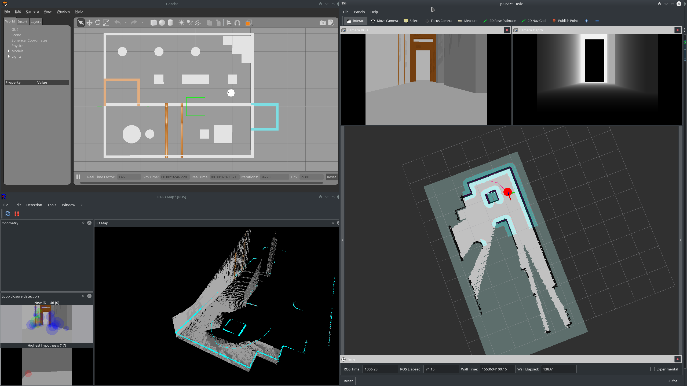
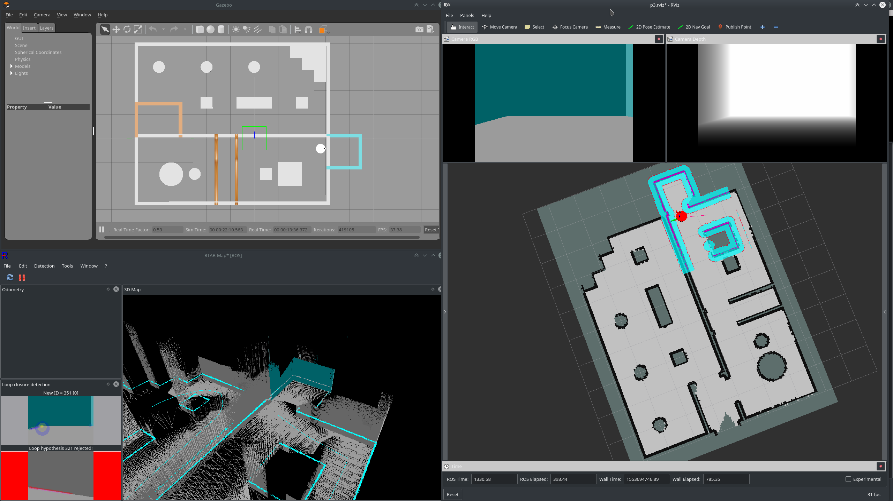

# Map My World

RTAB-Map tuning practice done for Project 5 of [Udacity Robotics Software Engineer Nanodegree](https://www.udacity.com/course/robotics-software-engineer--nd209).

This is a ROS package containing world and robot descriptions, parameters for rtabmap and move_base, and relevant launch files.

When run per instruction, you would get a Gazebo window showing the true robot pose, an rtabmapviz window showing the mapping progress, and an RViz window showing the partially constructed map, the robot pose estimate, and move_base's local map. Perform mapping by driving the robot with teleop, or by setting 2D nav goals (requires `move_base.launch`). Take care to only put nav goals in known clear area of the map (safest if within local map).

You will see something like below at early mapping stage:

And something like below at later mapping stage:

## Requirements

- [ROS Kinetic](http://wiki.ros.org/kinetic/Installation)
- [Gazebo simulator](http://gazebosim.org/) (you would have it if you installed ROS via ros-desktop-full)
- keyboard teleop package from [here](https://github.com/ros-teleop/teleop_twist_keyboard)
- ROS RTAB-Map [package](http://wiki.ros.org/rtabmap_ros)
- (optional) ROS move_base package

## Usage

Put this package in your workspace. Build your workspace, then continue along. 

You can do per-component launches or ensemble. For per-component, launch these:

- world.launch
- mapping.launch  
  also launches rtabmapviz, comment the relevant lines out if you do not wish to
- teleop.launch OR move_base.launch  
  that is inclusive OR, you can launch both
- (optional) rviz.launch

For ensemble, launch `ensemble_mapping.launch`. 

If you want to do localisation instead of mapping, replace `mapping.launch` with `localization.launch`. Alternately, replace `ensemble_mapping.launch` with `ensemble_localization.launch`.

Map will be saved in the `maps` directory of this package.